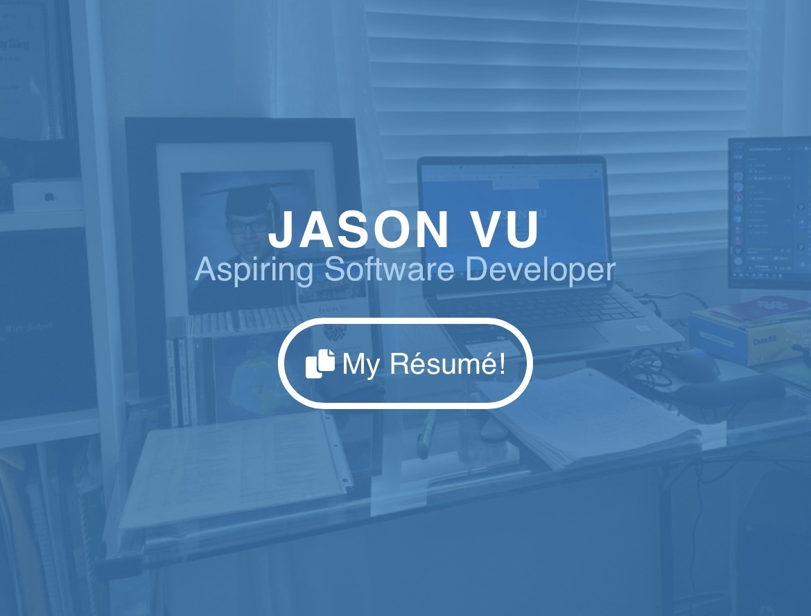

# Jason Vu's Personal Portfolio

    

- Written in HTML/CSS/JS using React JS and Bootstrap CSS, optimized with Google Lighthouse.

- Leveraged CI/CD GitHub workflow pipeline to receive code-pushing updates via Discord webhooks and deploy dynamically generated Latex resume and React JS components to portfolio for easier recruiter access.

## Google Lighthouse Audit

- 🖥 Desktop Responsiveness Audit: 

  - Average Performance: 100/100; Accessibility: 97/100; Best Practices: 100/100; SEO: 91/100

- 📲 Mobile Responsiveness Audit: 

  - Average Performance: 84/100; Accessibility: 96/100; Best Practices: 92/100; SEO: 92/100# portfolio
# portfolio
